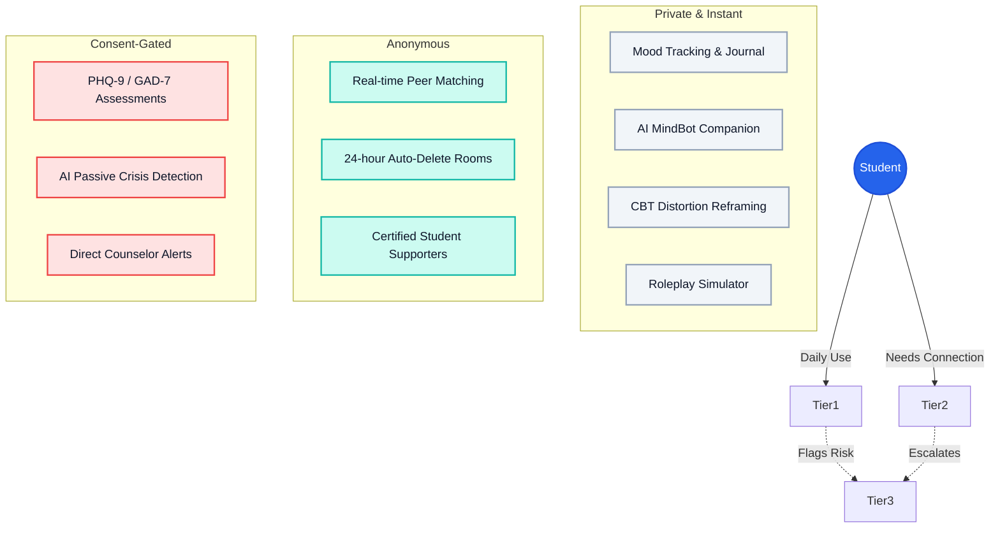

<div align="center">


<a href="https://git.io/typing-svg"></a>


<br/>
<br/>

<!-- Terminal Boot Sequence Simulation -->
<a href="https://git.io/typing-svg"></a>

<br/>
<br/>

 **Zero forced identification. Total data privacy. Immediate help.** 

</div>

---

##  The 3-Tier Support Architecture



---

##  Core Features

| Feature | Description |
| :--- | :--- |
| 🌤️ **Mood Landscapes** | Daily 1–5 mood logging with emotive tags (exam stress, sleep, family). Visualize emotional trends over time with immersive UI. |
| 🤖 **MindBot AI** | A persistent AI companion that remembers past check-ins, reads your assessment scores, and adjusts its tone dynamically to support you. |
| 🧩 **Detangle (CBT)** | Feed the AI a chaotic or anxious thought. It identifies the cognitive distortion (e.g., Catastrophizing) and helps you reframe it. |
| 🫂 **Anonymous Peer Rooms** | Real-time chat powered by Pusher. Matched by pseudonym hashes. All messages self-destruct after 24 hours to protect privacy. |
| 🚨 **Crisis Detection** | Passive natural language processing flags crisis language in real-time, instantly surfacing hotlines and alerting counselors. |
| 📱 **Native Capacitor App** | Wrapped in Capacitor for a true iOS/Android native feel, complete with system-level **Haptic Feedback** (`@capacitor/haptics`). |

---

##  Privacy & Safety, By Design

MindBridge treats anonymity as a first-class citizen, not an afterthought:
- 🕵️ **Zero Real Identities**: Students chat via hashed pseudonyms (`studentHash`), never real names.
- 🗑️ **Ephemeral Data**: MongoDB TTL indexes automatically wipe peer chat histories after 24 hours.
- 🛡️ **Consent-Gated Contact**: Emergency alerts notify counselors of the *situation*, but the student's real identity is only unmasked if they have explicitly checked `consentToContact`.
- 🛑 **AI Guardrails**: MindBot instantly drops its conversational persona when self-harm is detected, refusing to "play therapist" and enforcing immediate clinical routing.

---

##  Getting Started

### 1. Clone & Install
```bash
git clone https://github.com/theanarchist123/MindBridge.git
cd MindBridge
npm install
```

### 2. Environment Setup
Create a `.env.local` in the project root:
```env
# Database
MONGODB_URI=your_mongodb_connection_string

# Authentication
NEXTAUTH_URL=http://localhost:3000
NEXTAUTH_SECRET=your_random_secret

# Realtime Chat (Pusher)
PUSHER_APP_ID=
PUSHER_KEY=
PUSHER_SECRET=
PUSHER_CLUSTER=
NEXT_PUBLIC_PUSHER_KEY=
NEXT_PUBLIC_PUSHER_CLUSTER=

# AI (Local or Remote OpenAI-Compatible)
OLLAMA_BASE_URL=https://api.ollama.com
OLLAMA_API_KEY=your_key
OLLAMA_MODEL=gemma3:4b

# Admin Config
COUNSELLOR_INVITE_CODE=mindbridge-admin-2026
```

### 3. Run the Development Server
```bash
npm run dev
```

### 4. Build for Native (Capacitor)
```bash
npx cap sync
npx cap open ios      # Opens Xcode
npx cap open android  # Opens Android Studio
```

---

<div align="center">

**⚠️ Important Scope Note** <br/>
*MindBridge is a triage and support layer. It is **not** a replacement for professional clinical care. If you are in crisis, please call 1800-599-0019 (KIRAN, India) or 988 (US).*

Built with  for students who just need a safe space to start.

</div>